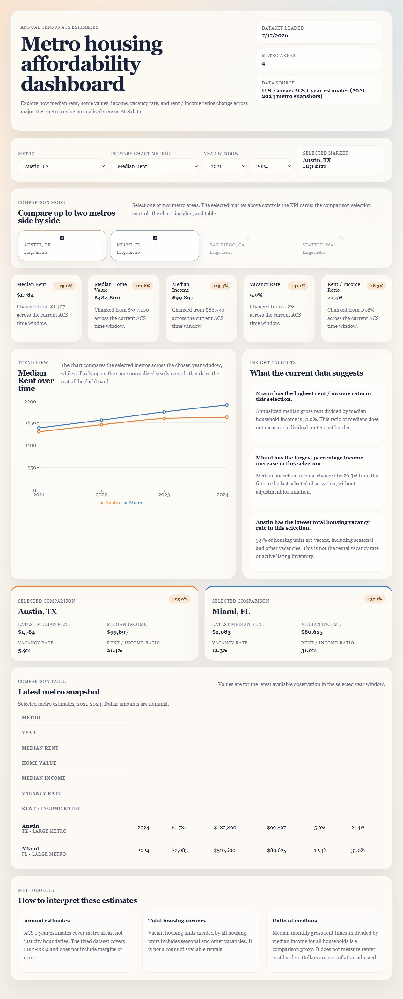

# Metro Housing Affordability Dashboard

Compare annual housing and income estimates for Austin, Miami, San Diego, and Seattle. The dashboard uses U.S. Census American Community Survey (ACS) 1-year metro estimates for 2021-2024, with 16 observations in the committed dataset.



## Current status

The dashboard runs locally from a committed dataset without an API key or database. PostgreSQL storage is optional. No public deployment URL is configured. Scheduled refresh requires a GitHub Actions secret and repository write permission; it does not update a hosted database. This is a personal project under active development. The dependency security gate currently fails on remaining transitive advisories; review them before public deployment (see [review notes](docs/REVIEW.md)).

## Features

- Five metric cards for a selected metro and year range.
- Compare one or two metros using a trend chart, latest-value table, and filtered insights.
- Python ingestion saves raw ACS responses and a normalized JSON artifact.
- Optional PostgreSQL import uses unique region/date keys, validation, and transactional upserts.
- Public read-only JSON endpoint at `/api/dashboard` and readiness endpoint at `/api/health`.

## Data and methodology

Source: [Census ACS API documentation](https://www.census.gov/data/developers/data-sets/acs-1year.html). City labels are shorthand for entire metropolitan statistical areas, identified by CBSA code.

| Metric | ACS variable / calculation | Interpretation |
| --- | --- | --- |
| Median monthly gross rent | B25064_001E | Includes contract rent and utilities |
| Median home value | B25077_001E | Owner-occupied housing estimate |
| Median household income | B19013_001E | All households, not renter households only |
| Total housing vacancy | B25002_003E / B25002_001E x 100 | Includes seasonal and other vacant units |
| Rent / income ratio | Median gross rent x 12 / median household income x 100 | Ratio of medians, not measured renter cost burden |

Amounts are nominal dollars. Comparisons omit inflation adjustments and margins of error; they should not be interpreted as statistically significant rankings or financial advice. The fixed year window does not automatically advance when Census releases a new vintage. `updatedAt` records artifact change time in file mode and successful import time in database mode, not the ACS release date.

## Architecture

```text
Census HTTPS API -> Python validation/normalization -> raw snapshots + processed JSON
                                                        |
                                          optional transactional Prisma import
                                                        |
                                      PostgreSQL: Region, MetricObservation, RefreshRun
                                                        |
                                 Next.js repository (file / database / explicit auto)
                                                        |
                                     server page + JSON API -> interactive React charts
```

Next.js 15 App Router, React 19, TypeScript, Recharts 2, custom CSS, Python standard library, Prisma 6 and PostgreSQL. File mode is the default so reviewers can reproduce the UI without services. Database mode fails when storage is missing, unreachable, empty, or has no successful import. Explicit `auto` mode may fall back to the artifact and logs that event. Reads occur at request time, not during the production build.

## Quick start

Requires Node.js 22 or 24 and pnpm 10.17.1. Python 3.12+ is needed only for ingestion and Python tests. Install the documented pnpm version with `npm install --global pnpm@10.17.1` if needed.

```sh
git clone https://github.com/YangOwen007/metro-housing-affordability-dashboard.git
cd metro-housing-affordability-dashboard
pnpm install --frozen-lockfile
pnpm db:generate
pnpm dev
```

Open [localhost:3000](http://localhost:3000). No environment file is required for the default file mode. To customize configuration, copy `.env.example` to `.env.local` (`Copy-Item .env.example .env.local` in PowerShell, `cp .env.example .env.local` on macOS/Linux).

| Variable | Required when | Purpose |
| --- | --- | --- |
| DATA_SOURCE_MODE | Optional; defaults to file | `file`, `database`, or `auto`; invalid values fail |
| DATABASE_URL | Database mode/import/migrations | PostgreSQL connection string; keep server-side |
| CENSUS_API_KEY | Fetching ACS data only | Census key; never required by the frontend |

Local scripts use shell variables first, then `.env.local`, then `.env`. Next.js uses its native environment loading. Never put credentials in `NEXT_PUBLIC_*` variables or commit local env files.

## Ingestion and storage

Set `CENSUS_API_KEY` locally, then run `pnpm data:refresh`. `python` must be on PATH; Windows users with the Python launcher can run `py -3 scripts/fetch_housing_data.py` instead. Requests have a 30-second timeout and reject missing/suppressed/nonfinite values. All responses validate before publishing; each artifact replacement is atomic, though the entire set of raw files is not one filesystem transaction. Unchanged observations preserve the timestamp to avoid weekly no-op commits.

For a **new, empty** PostgreSQL database, set `DATABASE_URL`, then:

```sh
pnpm db:generate
pnpm db:migrate
pnpm db:import
```

Set `DATA_SOURCE_MODE=database` and restart the app. Repeated imports update matching region/date rows rather than adding duplicate observations. Existing databases created with `db:push` need the baseline procedure in [the deployment guide](docs/DEPLOYMENT.md) before using migrations. `db:push` is only for disposable development databases. The importer does not remove rows absent from the current artifact.

## Checks and scripts

```sh
pnpm lint
pnpm typecheck
pnpm test
pnpm test:database # optional; DATABASE_URL required, uses a disposable schema
python -m unittest discover -s tests -p 'test_*.py' -v
pnpm security:scan
pnpm audit --audit-level high
pnpm build
pnpm start
```

`pnpm test` covers source selection, validation, UTC year boundaries, filtering, insights, and env precedence. Python tests cover parsing, ratio math, and error redaction. CI repeats these checks plus a production HTTP smoke test. The secret scan is heuristic, not a guarantee of absence. `pnpm setup:check` reports local prerequisites; `pnpm deploy:check` checks dataset/configuration and exits nonzero on failure, but cannot certify a remote account or service.

## Deployment

Recommended initial path: a Next.js deployment on Vercel with `DATA_SOURCE_MODE=file`. A hosting account and GitHub import remain required. Optional database deployment additionally needs a hosted PostgreSQL service, credentials, migrations, imported data, connection pooling, and backups. See [docs/DEPLOYMENT.md](docs/DEPLOYMENT.md) for exact setup, verification, and rollback steps.

## Security and privacy

Only public aggregate Census data is displayed; there is no login, user submission, analytics tracking, or private record collection. Both API endpoints are deliberately public and read-only. Secrets stay on the server or in the offline ingestion environment. API failure responses do not expose database exception text. Hosting TLS, traffic limits, and private database access must be configured on the host. Do not upload private data through this pipeline.

## Known limitations and next steps

- Four metros, four years, no automatic vintage discovery, inflation adjustment, or margins of error.
- File deployments require a redeploy to pick up changed artifacts. GitHub bot commits may not trigger downstream Actions; verify the host's Git integration explicitly.
- Database imports are manual; the refresh workflow only commits files. Production database integration and restore procedures need host-specific verification.
- Recharts 2 and ESLint 9 are older major versions. Dependency audit findings must be reviewed before publishing; see [review notes](docs/REVIEW.md).
- Automated tests do not constitute a full accessibility, browser, or load audit.
- No license has been selected. Public visibility does not grant reuse rights; choosing licensing terms is an owner decision.

Technical learning from this project includes modeling region/time-series data, separating ingestion from reads, deriving analytics from a common contract, and making storage failures visible without exposing credentials.
